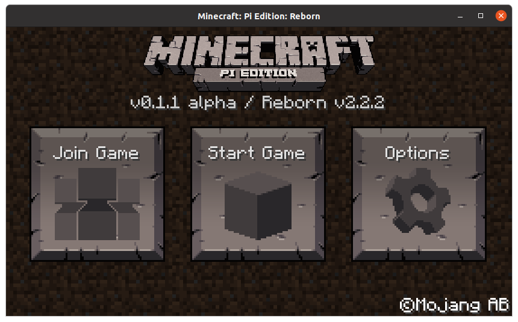

    

# Minecraft: Pi Edition: Reborn
Minecraft: Pi Edition Modding Project

## Documentation
[View Documentation](docs/README.md)

Anyways there isnt a specific way to compile this file manually, I did it in a weird way by opening the pi-apps install script and changing all references from the original github link to mine. So that's a way to do it ig? Lol idk im not experienced.
